# Healthcare & Pharma Commercial Analytics

**Linking HCP engagement to account-level sales, on data that could not be trusted, so a pharma
commercial team knows where to grow, where coverage is thin and which numbers to believe.**

> [!IMPORTANT]
> **All data in this project is synthetic.** It was generated for this portfolio case and designed
> from hands-on experience in HCP data operations. No real company, healthcare professional,
> customer, product or transaction is represented, and all names (e.g. *HCP Professional 00001*,
> *Pharma Product 001*) are fictitious. Defects such as duplicates and invalid dates were injected
> on purpose to exercise the data-quality pipeline.


**[▶ Live interactive dashboard](https://YOUR-GITHUB-USERNAME.github.io/pharma-commercial-analytics/)** ·
[What's inside](#7--whats-in-this-repository) · [Documentation](docs/README.md) · [SQL pipeline](sql/README.md) · [Power BI](powerbi/README.md) · [Decision log](docs/decision_log.md)

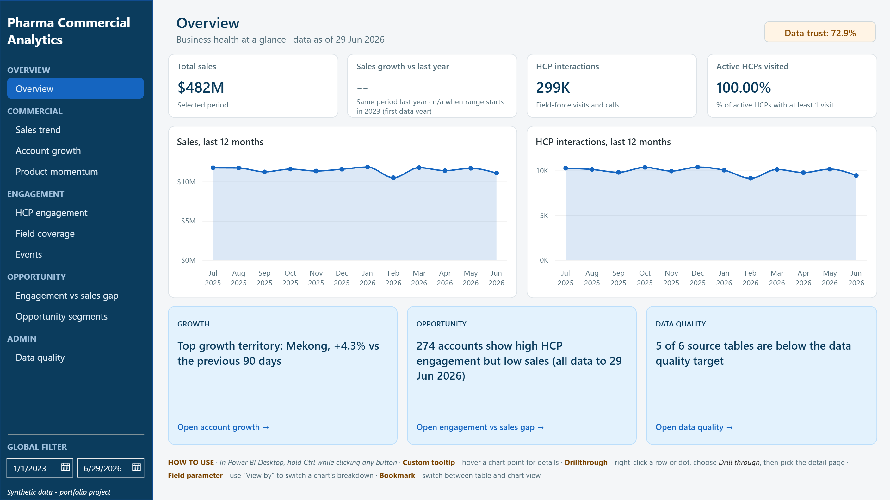

---

## At a glance

| | |
|---|---|
| **Scope** | 10 **synthetic** source extracts · 89 columns · ~2 M rows, modelled on real HCP data operations |
| **Data quality** | 67 issues logged and handled - each fixed, flagged, quarantined or accepted in exactly one layer |
| **Pipeline** | SQL Server, layered `raw → staging → master → warehouse → mart` |
| **Model** | Star schema: 6 dimensions, 5 facts incl. a factless HCP ↔ account bridge, 5 analytical tier tables |
| **Semantic layer** | 101 DAX measures (100 with a business description), 5 field parameters, 3 what-if thresholds, a 20-flag data-quality catalog |
| **Report** | 10 pages + 3 drill-through pages + 2 report-page tooltips, answering 9 business questions |

## 1 · Context

A pharma company **engages Healthcare Professionals (HCPs)** through field reps, events and campaigns,
but **sells to accounts** such as hospitals, clinics, pharmacies and distributors. HCPs are never
invoiced, and one HCP can work at several accounts.

Leadership wanted to know: *is our engagement effort landing where the commercial opportunity is?*
They could not answer it:

- engagement data and sales data had **no shared view**;
- the data had **duplicates, placeholder values, impossible dates and orphan records**, so reports
  disagreed;
- there was **no prioritised list** of accounts, HCPs or territories to act on.

## 2 · Business questions

| # | Question | Page |
|---|---|---|
| Q1 | How are sales trending by month, territory, account type, product and therapeutic area? | 02 Sales trend |
| Q2 | Which customer accounts drive growth? | 03 Account growth |
| Q3 | Which HCPs engage strongly with priority products? | 05 HCP engagement |
| Q4 | Which accounts have strong HCP engagement but low commercial penetration? | 08 Engagement vs sales gap |
| Q5 | How effectively does the field force cover active HCPs and accounts? | 06 Field coverage |
| Q6 | Which events generate strong attendance and follow-up? | 07 Events |
| Q7 | Which products and therapeutic areas gain or lose momentum? | 04 Product momentum |
| Q8 | Which HCP and account segments represent opportunity? | 09 Opportunity segments |
| Q9 | How does data quality affect reporting trust? | 10 Data quality |

→ [Business context in detail](docs/01_business_context.md) · [Data landscape](docs/02_data_landscape.md)

## 3 · Approach

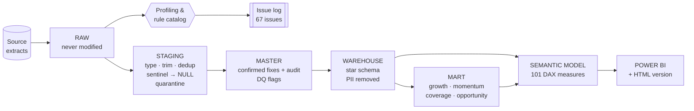

### Making the data trustworthy

The core rule: **change a value only when the cause is confirmed. Otherwise flag it and let the
report show its impact.**

| What was found | Treatment |
|---|---|
| 2,746 exact duplicates across 9 tables | removed in staging |
| Placeholder values: `'invalid-email'`, `'12345'`, end date `1900`, impossible dates such as `2027-15-40` | converted to NULL |
| ~28 K case and spelling variants | standardised via mapping tables |
| Orphan references such as `HCP99999` and `PRD999` | quarantined, never guessed |
| 169 reversed affiliation dates · 153 reps in the wrong territory | corrected in master **with audit columns** after the cause was confirmed |
| Interactions before the rep's hire date (10 %) · registrations after event start (51 %) · sales before launch (16 %) | **flagged, not changed**, and surfaced on the Data Quality page |
| Negative quantity, zero price, amount ≠ qty × price | flagged and excluded from *Total Sales* |

A lesson recorded along the way: a rule first reported 13 active HCPs with no interaction in 90 days. It had been
checked against today's date on a dataset that ends in June 2026. Re-run at a fixed as-of date, it
found **0**, so all recency logic now uses that as-of date.

→ [Data quality approach with a worked example](docs/03_data_quality_approach.md) · [All 67 issues](docs/dq_issue_register.md)

### Modelling engagement and sales without faking causality

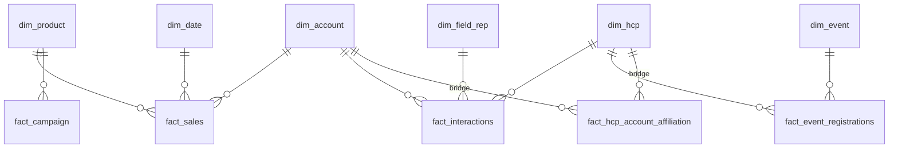

Sales attach to **accounts** and engagement to **HCPs**. A factless affiliation bridge connects the
two, so engagement vs sales is read as association at account level, never as cause and effect.
A mart layer then turns each open question into one label per entity (*Growing / Declining*,
*Rising / Stable*, opportunity quadrant) that a user can simply filter on.

→ [Architecture & data model](docs/04_architecture_and_data_model.md)

### A governed semantic model

Raw numeric columns are hidden and implicit measures are disabled, so every number passes through a
measure that applies the data-quality exclusions. Business definitions are stored on each measure,
and personal data is removed before the model.

→ [Semantic model & dashboard design](docs/05_semantic_model_and_dashboard.md)

## 4 · Dashboard

The report is organised like an app: a left navigation groups the pages into **Overview · Commercial ·
Engagement · Opportunity · Admin**, and every chart can drill through to an account, HCP or rep.

| Page | Answers | Screenshot |
|---|---|---|
| **01 · Overview** | headline KPIs, 12-month trends, auto-generated highlights |  |
| **02 · Sales trend** | Q1 | 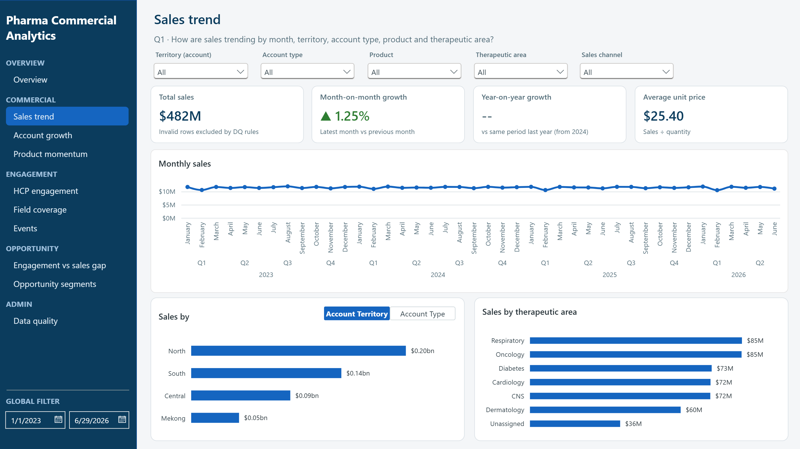 |
| **03 · Account growth** | Q2 | 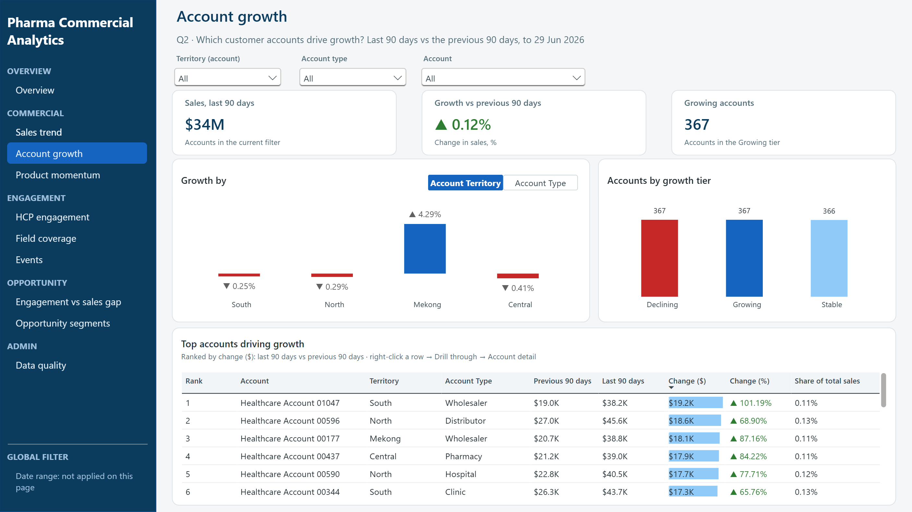 |
| **04 · Product momentum** | Q7 | 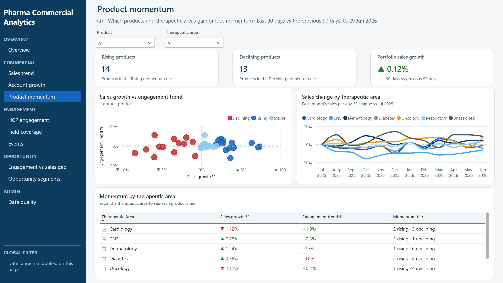 |
| **05 · HCP engagement** | Q3 | 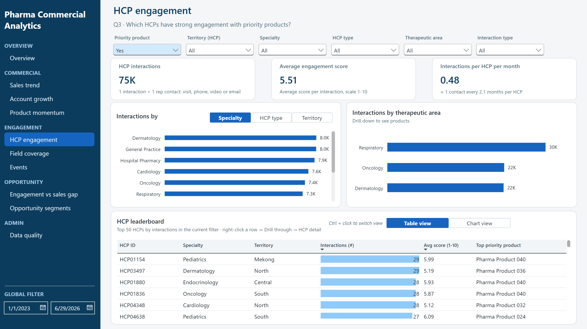 |
| **06 · Field coverage** | Q5 | 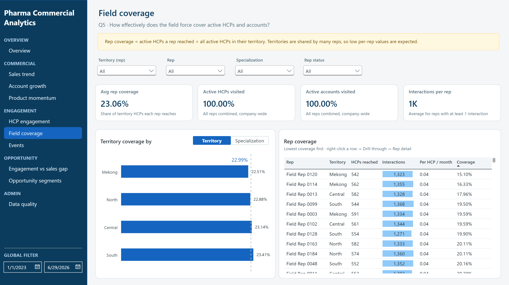 |
| **07 · Events** | Q6 | 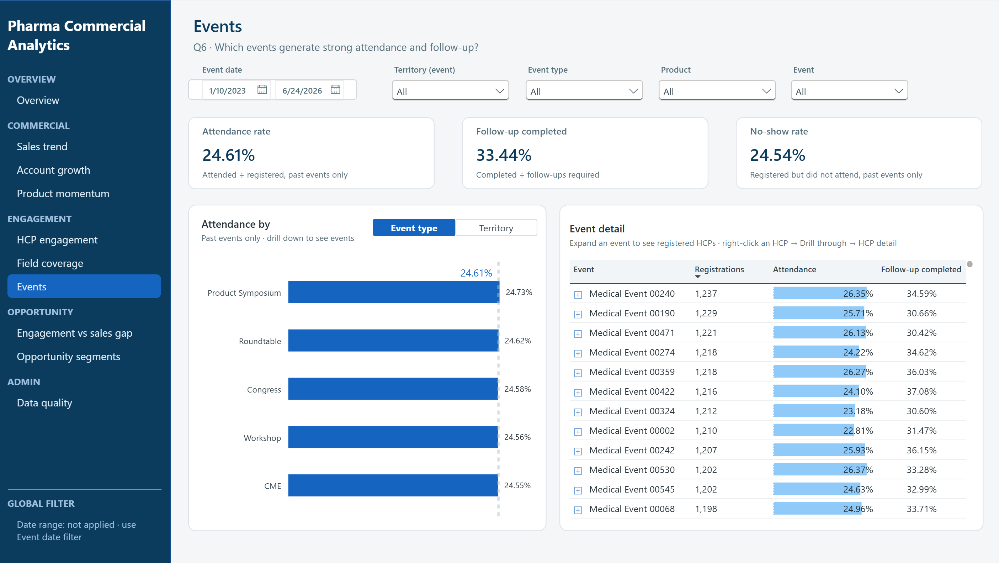 |
| **08 · Engagement vs sales gap** | Q4 | 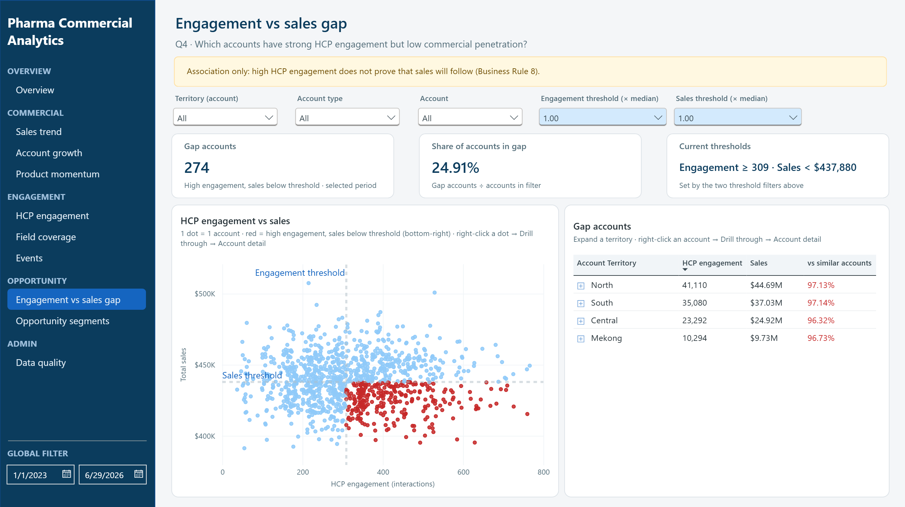 |
| **09 · Opportunity segments** | Q8 | 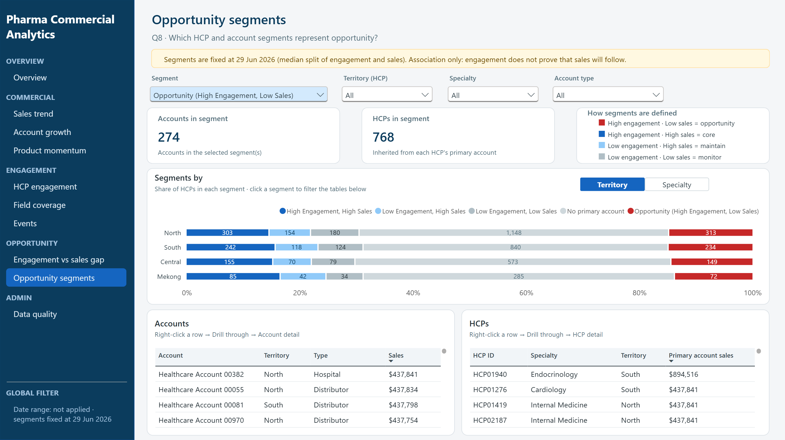 |
| **10 · Data quality** | Q9 | 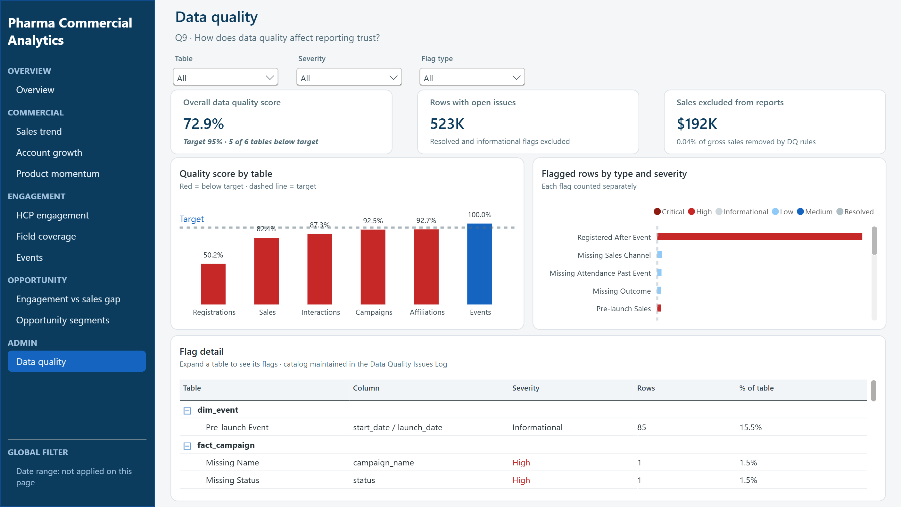 |
| **Drill-through · Account detail** | one account: sales, products, affiliated HCPs | 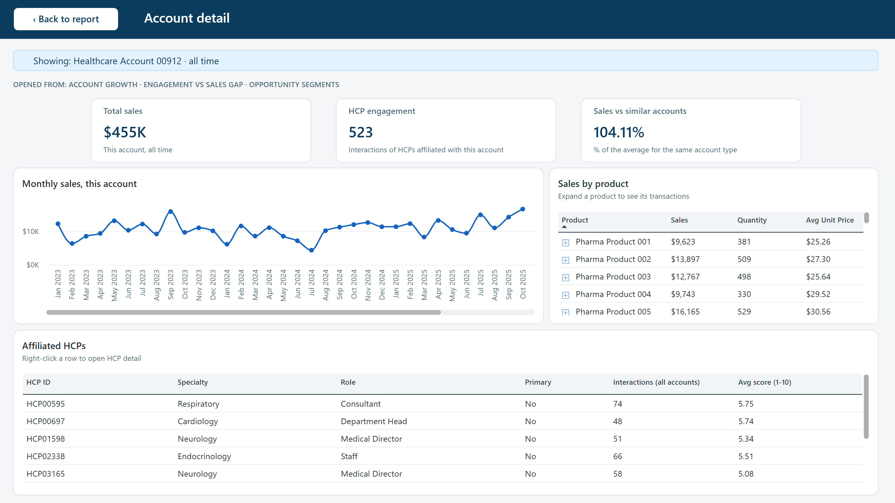 |
| **Drill-through · HCP detail** | one HCP: interactions, accounts, events | 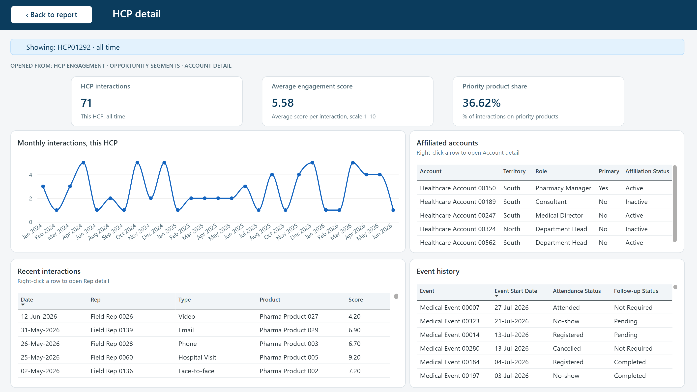 |
| **Drill-through · Rep detail** | one rep: activity, HCPs and accounts reached | 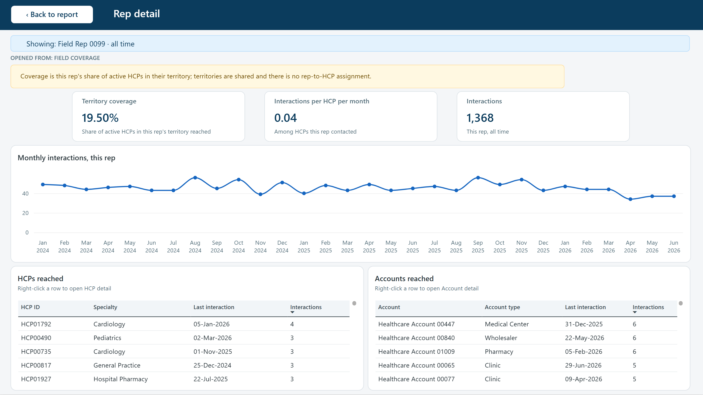 |

Page-by-page design: [docs/05](docs/05_semantic_model_and_dashboard.md#dashboard)

## 5 · Key insights

*Period: Jan 2023 to the as-of date 29 Jun 2026. Synthetic data: the figures show the method, not a real market.*

| # | Question | What the data shows | What to do |
|---|---|---|---|
| 1 | Is sales going up or down? | Flat: **$482.2M** in total, about $138M a year, H1 2026 **+0.6 %**. Many small gains and losses cancel out. | Set growth targets by territory and therapeutic area; use Mekong (+2.1 % YoY) as the test territory. |
| 2 | Which accounts grow or decline? | Growth is spread out: the top 50 growing accounts make up only 22 % of gains. **81 large accounts** ($11.1M a year) are declining. | Watch-list for the 81 large declining accounts; review wholesaler terms (-2.1 %). |
| 3 | Which products lose momentum? | **6 of the 10 priority products** are declining; only 1 is rising. | Product-by-product review of the 6 before adding field effort. |
| 4 | How engaged are HCPs? | Activity is high, but **51 %** of interactions go to HCPs marked inactive and 54 % are logged by inactive reps. 418 active HCPs saw their contacts halve. | Refresh HCP and rep status; run a win-back plan for the 418. |
| 5 | Is field coverage balanced? | Everyone is reached, but North reps carry **31.6 active HCPs** each vs 20.6 in South, and the most sales and opportunity accounts. | Move about 6–7 reps of capacity toward North. |
| 6 | Do events create engagement? | Attendees and no-shows are contacted at the same rate afterwards (1.31 vs 1.31 in 30 days). 200 of 534 past events are still marked *Planned*. | Close events in the CRM within 7 days; add a 14-day follow-up. |
| 7 | Does high engagement mean high sales? | Not clearly. High-engagement accounts simply have twice as many linked HCPs (7.4 vs 3.8). | Rank accounts on engagement per linked HCP. |
| 8 | Where is the opportunity? | **274 accounts** are engaged but under-selling; reaching the median is worth about **$3.6M**, $1.5M of it in the top 50. | 3-month pilot on the top 50, with a comparison group. |
| 9 | Can the data be trusted? | Sales totals yes (only 0.04 % of value excluded). Dates, statuses and event outcomes no: 49 % of registrations are logged after the event. | Fix at source (CRM timestamps, launch and hire dates, statuses), not in reports. |

→ [Insights, actions and owners](docs/06_insights_and_recommendations.md) · [Validation & next steps](docs/07_validation_and_next_steps.md)

## 6 · Key decisions

| Decision | Trade-off |
|---|---|
| Raw is never edited | more storage, full auditability |
| Flag instead of fix when the cause is unknown | messier model, no invented data |
| Campaign modelled as a fact, not a dimension | no campaign ROI until a bridge exists |
| Separate mart from warehouse | one more layer, stable reusable core |
| Fixed as-of date instead of `GETDATE()` | must be updated per load, reproducible results |

→ [All 13 decisions](docs/decision_log.md)

## 7 · What's in this repository

Every step of the analytics workflow has a deliverable you can open:

| # | Workflow step | Deliverable | Where |
|---|---|---|---|
| 1 | Business understanding | Business problem, 9 questions, stakeholders | [docs/01_business_context.md](docs/01_business_context.md) |
| 2 | Data understanding | Data landscape + column-level data dictionary | [docs/02_data_landscape.md](docs/02_data_landscape.md) · [docs/data_dictionary.md](docs/data_dictionary.md) |
| 3 | Data profiling & quality checks | Profiling, DQ rules, business-rule checks | [sql/02_profiling](sql/02_profiling) · [sql/03_data_quality](sql/03_data_quality) · [DQ Issue Register](docs/dq_issue_register.md) |
| 4 | Data cleaning (ETL) | Staging and master scripts, one per table | [sql/04_staging](sql/04_staging) · [sql/05_master](sql/05_master) · [docs/03](docs/03_data_quality_approach.md) |
| 5 | Data modelling | Star schema + analytical mart | [sql/06_warehouse](sql/06_warehouse) · [sql/07_mart](sql/07_mart) · [docs/04](docs/04_architecture_and_data_model.md) |
| 6 | SQL analysis | One query per business question (Q1-Q9) | [sql/08_analysis](sql/08_analysis) |
| 7 | Power BI report & measures | Report (.pbix, opens with data) + Power BI project (.pbip: model, DAX, layout as readable text) + all 101 measures in one file | [powerbi/](powerbi/README.md) · [docs/05](docs/05_semantic_model_and_dashboard.md) |
| 8 | Dashboard | Screenshots + interactive HTML version | [assets/screenshots](assets/screenshots) · [dashboard/](dashboard/README.md) |
| 9 | Validation | Row-count lineage, KPI reconciliation SQL ⇄ Power BI, UAT | [sql/09_validation](sql/09_validation) · [docs/07](docs/07_validation_and_next_steps.md) |
| 10 | Insights & recommendations | Findings, actions, owners, sizing | [docs/06_insights_and_recommendations.md](docs/06_insights_and_recommendations.md) |
| + | Design decisions | 13 judgement calls and their trade-offs | [docs/decision_log.md](docs/decision_log.md) |

```
pharma-commercial-analytics/
├── README.md                  ← you are here
├── docs/                      the story: context → data → quality → model → report → insights
├── sql/                       58 scripts, raw → validation, each with a DETECT / RULES header
├── powerbi/                   HCP_Analytics.pbix · HCP_Analytics.pbip project · measures.dax (101 measures)
├── dashboard/                 interactive HTML version (GitHub Pages)
└── assets/screenshots/        dashboard images
```

**Tools:** SQL Server · SSMS · Power BI Desktop · DAX · Excel / Google Sheets

*All data is synthetic. The source CSV files are not published; the .pbix contains the modelled (synthetic) data needed to explore the report. It was designed from hands-on experience in HCP data
operations and does not represent any real company, person or transaction.*

---

**Quynh Tram** · Data & Healthcare Operations · [LinkedIn](https://www.linkedin.com/in/quynhtramlengoc/)
