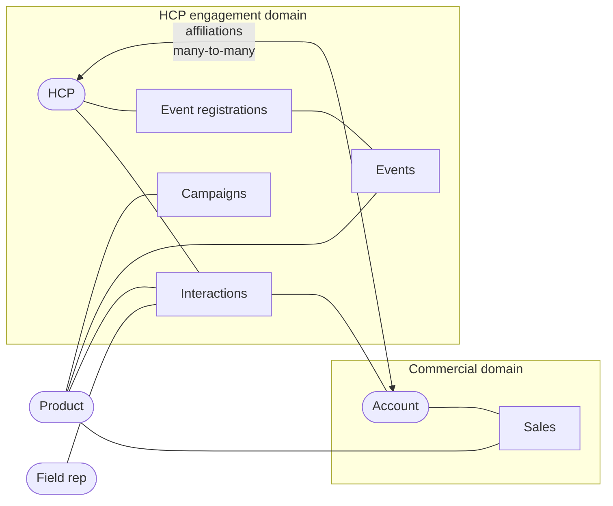

# 02 · Data Landscape

> [!IMPORTANT]
> The dataset is **100 % synthetic and not published**. Names, IDs, contact details and figures are fictitious.

 Its structure mirrors what a pharma commercial team
typically holds across CRM, event and sales systems, and it was seeded with the defects those
systems really produce. This page describes it well enough to follow the rest of the project.

## Sources

| Source | Grain (1 row =) | Role | Volume | Main attributes |
|---|---|---|---:|---|
| HCP | healthcare professional | Master | ~5.2 K | type, specialty, city, territory, status, contact details |
| Customer accounts | hospital / clinic / pharmacy / distributor … | Master | ~1.1 K | account type, territory, parent account (hierarchy) |
| HCP ↔ account affiliations | one HCP-account relationship over time | Bridge | ~12.5 K | role, primary flag, start / end date, status |
| Products | product | Master | 40 | therapeutic area, priority flag, launch date |
| Field reps | sales representative | Master | ~220 | territory, base city, hire date, specialization |
| Interactions | one rep-HCP interaction *at an account* | Fact | ~320 K | channel, type, duration, outcome, engagement score |
| Events | medical event | Master | ~550 | type, dates, territory, product, budget |
| Event registrations | one HCP registration to an event | Fact | ~650 K | attendance, follow-up required / status, source |
| Sales | one invoice line to an account | Fact | ~1.05 M | channel, order type, quantity, unit price, amount |
| Campaigns | marketing / engagement campaign | Master | ~70 | type, product, dates, target HCP count, budget |

**10 sources · 89 columns · ~2 M rows.** Column-level detail: [Data Dictionary](data_dictionary.md).

## How the entities connect

Two bridges connect engagement to commerce: the **affiliation** table (which HCP works where) and the
**account context stored on each interaction**. Sales carry no HCP at all.

## Business rules

1. Sales are attributed to customer accounts, not directly to HCPs.
2. HCPs represent engagement / influence targets.
3. HCP ↔ account is many-to-many.
4. Interactions carry both HCP and account context.
5. Invalid sales transactions are investigated before analytical use.
6. Negative quantity and non-positive price require data-quality treatment.
7. Invalid foreign keys are quarantined or resolved - never silently remapped.
8. HCP engagement does not prove sales causality.
9. Candidate business keys (e-mail, tax id, invoice number) must be validated by profiling before use.
10. Raw data remains unchanged.
11. A populated `parent_account_id` must reference a valid account.

## Personal & sensitive data

| Data | Sensitivity | Handling |
|---|---|---|
| HCP name, e-mail, phone | High - personal | Used for cleaning only; **removed before the analytical model** |
| Account tax id, phone | Medium | Removed before the analytical model |
| HCP id, city | Medium | Kept (pseudonymous id, city aggregated in reporting) |
| Rep name | Medium - employee | Kept, designed for row-level security (managers only) |
| Account name | Organisation, not personal | Kept |
