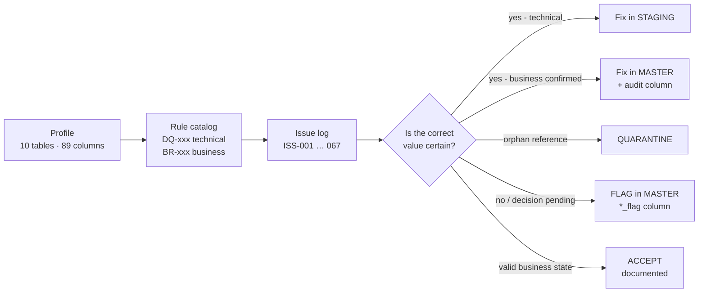

# 03 · Data Quality: From Messy Sources to Trusted Data

## Principle

> **Profiling describes the data. Data-quality rules judge it.**
> A profiling metric becomes a rule only when it has an explicit pass/fail criterion.
> Every failed rule becomes an **issue**, and every issue is resolved in **exactly one layer**.



## What was found - and how each pattern was handled

| Pattern | Scale | Treatment | Why |
|---|---|---|---|
| Exact duplicate rows | 2,746 rows across 9 tables | Removed in staging (`ROW_NUMBER` over all columns) | Identical rows carry no information |
| Placeholder / sentinel values - `'invalid-email'`, `'12345'`, end date `1900-…`, `2020-01-01` | 5,500+ rows | → `NULL` in staging | Placeholder ≠ value; must not count as data |
| Impossible dates - `2027-15-40`, `2026-99-99`, `2025-02-30` | products, reps, campaigns | `TRY_CAST` → `NULL` | Cannot be repaired without the source |
| Case / spelling variants - `cardiology`, `hcp engagement`, attendance and sales-channel variants | ~28 K rows | **Mapping tables** in staging | The fix is data, not hard-coded logic |
| Orphan foreign keys - `HCP99999`, `ACC99999`, `EVT99999`, `PRD999` | 5 tables | **Quarantined**, excluded from analytics | Never guess which entity was meant (BR-7) |
| Reversed affiliation dates | 169 rows | **Swapped in master**, `date_swap_applied = 1` | Cause confirmed |
| Rep territory contradicting base city | 153 reps (69 %) | **Territory re-derived** from confirmed city→territory map, `territory_source` keeps old value | Confirmed with the business owner |
| Cross-table timing conflicts - interaction before rep hire (10 %), registration after event start (51 %), sale before product launch (16 %) | large | **Flagged**, not changed | Unknown which side is wrong |
| Commercial anomalies - negative quantity, price ≤ 0, amount ≠ qty × price | ~2.6 K sales rows | **Flagged**; excluded from *Total Sales* | Unknown which field is wrong; do not recompute |
| Optional contact fields missing - e-mail, phone, tax id | - | **Accepted** | Not required for any question |

Full list of 67 issues with rule, scale and layer: **[DQ Issue Register](dq_issue_register.md)**.

## Three layers, three responsibilities

| Layer | Allowed to | Not allowed to |
|---|---|---|
| **Raw** | store the file exactly as received (all text columns) | change anything |
| **Staging** | type-cast, trim, blank → NULL, sentinel → NULL, map case variants, remove exact duplicates, quarantine orphan keys | make any change that needs a business decision |
| **Master** | add surrogate keys, apply **confirmed** business corrections with an audit column, add `*_flag` columns | overwrite a value whose cause is unknown |

## The method applied to every table

`DETECT` → `DEFINE RULE` → `TRANSFORM` → `TEST` → `VALIDATE`

| Step | Question it answers |
|---|---|
| Detect | Which logged issues touch this table - and which belong to this layer? |
| Define rule | What exactly happens to each column? |
| Transform | The SQL that builds the table |
| Test | Does each known bad value come out as intended? (case-level) |
| Validate | Do row counts reconcile, are keys unique, are domains clean? (table-level) |

### Worked example - sales (≈1 M rows)

**Detect**

| Issue | Finding | Layer |
|---|---|---|
| ISS-038 | 1,050 duplicate `sales_id` | Staging |
| ISS-040 | `sales_channel` case variants (1.5 %) | Staging - mapping table |
| ISS-043/044 | channel / invoice blank | Staging (NULL) → Master (flag) |
| ISS-062/063 | orphan account / product keys | Staging - quarantine |
| ISS-039 | sale before product launch (16 %) | Master - flag |
| ISS-041/042 | negative quantity / price ≤ 0 | Master - flag, excluded from Total Sales |
| ISS-045 | amount ≠ qty × price (0.1 %) | Master - flag, **not recomputed** |

**Transform** - excerpt from [`stg_sales.sql`](../sql/04_staging/stg_sales.sql) (step B, after the orphan keys were moved to quarantine):

```sql
WITH cleaned AS (
	SELECT
		TRIM(s.sales_id) AS sales_id,
		TRY_CAST(s.sales_date AS DATE) AS sales_date,
		TRIM(s.account_id) AS account_id,
		TRIM(s.product_id) AS product_id,
		NULLIF(TRIM(s.territory), '') AS territory,
		COALESCE(m.canonical_value, NULLIF(TRIM(s.sales_channel), '')) AS sales_channel,
		NULLIF(TRIM(s.order_type), '') AS order_type,
		NULLIF(TRIM(s.invoice_number), '') AS invoice_number,
		TRY_CAST(s.quantity AS INT) AS quantity,
		TRY_CAST(s.unit_price AS DECIMAL(10,2)) AS unit_price,
		TRY_CAST(s.sales_amount AS DECIMAL(12,2)) AS sales_amount
	FROM raw.raw_sales AS s
	LEFT JOIN stg.map_sales_channel AS m
		ON LOWER(TRIM(s.sales_channel)) = LOWER(m.raw_value)
	WHERE TRIM(s.account_id) <> 'ACC99999' AND TRIM(s.product_id) <> 'PRD999'
),
deduped AS (
	SELECT *,
		ROW_NUMBER() OVER (
			PARTITION BY sales_id, sales_date, account_id, product_id, territory, sales_channel,
			             order_type, invoice_number, quantity, unit_price, sales_amount
			ORDER BY (SELECT NULL)
		) AS rn
	FROM cleaned
)
INSERT INTO stg.stg_sales (...)
SELECT ... FROM deduped WHERE rn = 1;
```

**Master** - flag, don't fix (excerpt from [`master_sales.sql`](../sql/05_master/master_sales.sql)):

```sql
SELECT
	s.sales_id, s.sales_date, s.account_id, s.product_id, ...,
	CASE WHEN p.launch_date IS NOT NULL AND s.sales_date < p.launch_date THEN 1 ELSE 0 END,  -- pre_launch_sales_flag
	CASE WHEN s.quantity < 0 THEN 1 ELSE 0 END,                                              -- negative_quantity_flag
	CASE WHEN s.unit_price <= 0 THEN 1 ELSE 0 END,                                           -- non_positive_price_flag
	CASE WHEN s.sales_channel IS NULL THEN 1 ELSE 0 END,                                     -- missing_sales_channel_flag
	CASE WHEN s.invoice_number IS NULL THEN 1 ELSE 0 END,                                    -- missing_invoice_number_flag
	CASE WHEN s.quantity IS NOT NULL AND s.unit_price IS NOT NULL AND s.sales_amount IS NOT NULL
	      AND ABS(s.sales_amount - (s.quantity * s.unit_price)) > 0.01
	     THEN 1 ELSE 0 END                                                                    -- amount_mismatch_flag
FROM stg.stg_sales AS s
LEFT JOIN stg.stg_products AS p ON s.product_id = p.product_id;
```

**Validate** - raw rows − duplicates − quarantined = staging rows = master rows = fact rows; `sales_id`
unique; no unmapped channel values.

Full scripts for all 10 tables, each with its own DETECT / RULES header: [`sql/`](../sql/README.md).

## A lesson worth recording

Business rule BR-009 (*"active HCP with no interaction in 90 days"*) first reported 13 violations.
Investigation showed the check used `GETDATE()` on a dataset that ends in June 2026. Re-run at the
fixed **as-of date 2026-06-29** → **0 violations**. Since then all recency logic uses the as-of date
([D-09](decision_log.md)) - results are reproducible whatever day the pipeline runs.
