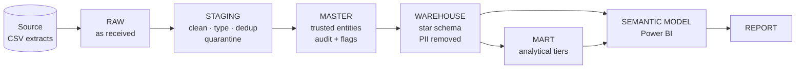
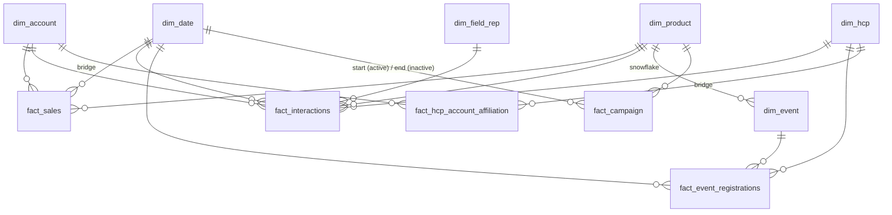

# 04 · Architecture & Data Model

## Pipeline (SQL Server)

| Layer | Schema | Purpose |
|---|---|---|
| Raw | `raw` | Preserve the source exactly - the audit baseline |
| Staging | `stg` | Clean, standardise, type, de-duplicate, quarantine |
| Master | `master` | Trusted business entities with surrogate keys, audit columns and DQ flags |
| Warehouse | `warehouse` | Star schema for analysis; personal data removed |
| Mart | `mart` | Question-specific labels (tiers, quadrants) |
| Semantic model | Power BI | Relationships, measures, hierarchies, security |

**Design principle:** separate influence entities (HCPs) from transaction entities (accounts).

## Grain

Choosing the grain first is what keeps the numbers additive and the joins safe.

| Fact | 1 row = | Note |
|---|---|---|
| `fact_sales` | one sales transaction | account-level; no HCP |
| `fact_interactions` | one rep-HCP interaction at an account | links engagement to accounts |
| `fact_event_registrations` | one HCP registration to an event | attendance and follow-up |
| `fact_hcp_account_affiliation` | one HCP-account relationship for a period | **factless bridge** resolving many-to-many |
| `fact_campaign` | one campaign | budget and target HCP count |

**Why is campaign a fact and not a dimension?** Each campaign is something that *happened*, with
money committed and targets set - it answers *what happened / how much*, not *who / what / where*.
([D-07](decision_log.md))

## Star schema

| Modelling choice | Reason |
|---|---|
| **Surrogate keys** (`*_key`, created once in master, reused downstream) for every join; business keys (`*_id`) kept for audit | Stable joins, traceable back to source |
| Dimension → fact relationships **many-to-one, single direction** | Predictable filter propagation |
| Mart tables joined **one-to-one, both directions** to their dimension | Each mart row only adds labels (tier, quadrant) to one dimension row, so it behaves like extra columns of that dimension |
| Affiliation bridge with single-direction filters | Avoids ambiguous paths with sales / interactions, which also join accounts |
| Role-playing date on campaigns: start active, end inactive (`USERELATIONSHIP`) | Power BI allows one active path per table pair |
| `dim_event → dim_product` snowflake | Events belong to a product; keeps product attributes in one place |

## Data mart - turning questions into labels

The warehouse stays neutral and reusable; the mart holds logic specific to today's questions, so a
new question changes only the mart ([D-08](decision_log.md)). Each mart table turns an open question
into **one label per entity** that a dashboard user can simply filter on.

| Mart table | Question | Label |
|---|---|---|
| `tbl_account_growth` | Q2 - which accounts grow or decline? | Growing · Stable · Declining · New · Inactive |
| `tbl_product_momentum` | Q7 - which products heat up or cool down? (sales + engagement trend) | Rising · Stable · Declining · New · Inactive |
| `tbl_rep_coverage` | Q5 - which reps cover their HCPs well? | High · Medium · Low |
| `tbl_account_opportunity` | Q8 - high engagement, low sales? | 4 opportunity quadrants |
| `tbl_hcp_opportunity` | Q8 - which HCPs sit in those accounts? | quadrant inherited through the primary affiliation |
