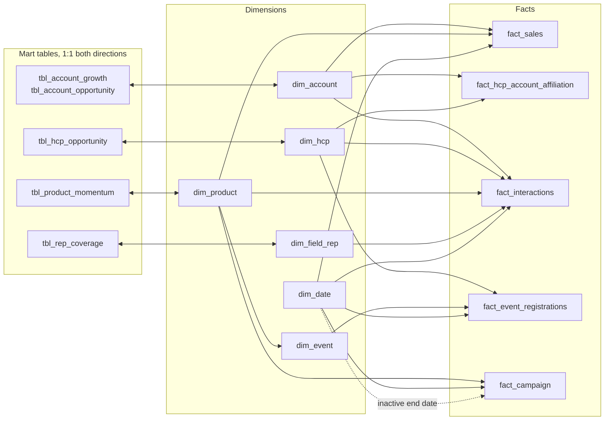

# Power BI

> The data inside `HCP_Analytics.pbix` is **synthetic**: generated for this portfolio case, with fictitious names and figures.

The report is published in two formats with different purposes:

| Format | Use it to | Data |
|---|---|---|
| **`HCP_Analytics.pbix`** | **open and explore the report**: click, filter, drill through | included (import mode, opens offline) |
| **`HCP_Analytics.pbip`** Power BI Project | **read the model as code on GitHub**: tables, relationships, measures, visuals | not included (definition only) |
| **`measures.dax`** | read every measure in one file, grouped by folder, with its business description | - |

```
powerbi/
├── HCP_Analytics.pbix                  the report - open with Power BI Desktop (free)
├── HCP_Analytics.pbip                  same report as a project
├── HCP_Analytics.SemanticModel/        TMDL: one file per table, relationships, measures
├── HCP_Analytics.Report/               pages, visuals, bookmarks, theme
└── measures.dax                        101 measures, extracted from the model
```

## Open the report

1. Install [Power BI Desktop](https://www.microsoft.com/power-bi/desktop) (free, Windows).
2. Download **`HCP_Analytics.pbix`** and open it. The data is imported, so no database is needed.
3. Buttons and bookmarks need **Ctrl + click** in Desktop.

No Power BI? See the [screenshots](../README.md#4--dashboard) or the live HTML version linked at the top of the main README.

## Model at a glance

| Component | Count | Detail |
|---|---:|---|
| Tables from SQL Server | 16 | 6 dimensions · 5 facts · 5 mart tables, loaded with Power Query parameters `pServer` / `pDatabase` |
| DAX measures | 101 | in display folders: Base · Sales · Engagement · Coverage · Events · Engagement-Sales Gap · Opportunity · Data Quality · Drill-through · What-if. 100 of them carry a business description |
| Field parameters | 5 | Account, HCP, Rep, Event and Segment views ("… by [dimension]" visuals) |
| What-if parameters | 3 | Engagement threshold, Sales threshold (0.5×–2× median), DQ target (90 %–100 %) |
| Calculated tables | 2 | `DQ Flag Catalog` (20 data-quality flags with type and severity) · `Segment` |
| Calculated columns | 7 | date helpers (`Quarter`, `Year Month`, `Is Last 12M` …) and Yes/No labels |
| Relationships | 22 | see below |

## Relationships



| Type | Setting | Why |
|---|---|---|
| Dimension → fact (15 active) | many-to-one, single direction | predictable filtering from dimensions to facts |
| `dim_event` → `dim_product` | many-to-one, single (snowflake) | events belong to a product |
| `fact_campaign` → `dim_date` (end date) | **inactive**, used with `USERELATIONSHIP` | role-playing date: start date is the active one |
| Dimension ↔ mart table (5) | **one-to-one, both directions** | each mart table adds labels (tier, quadrant) to exactly one dimension row, so it behaves like extra columns of that dimension |
| HCP ↔ account | through `fact_hcp_account_affiliation` | many-to-many resolved by a bridge, both sides single direction |

Model design and governance: [docs/05](../docs/05_semantic_model_and_dashboard.md)
