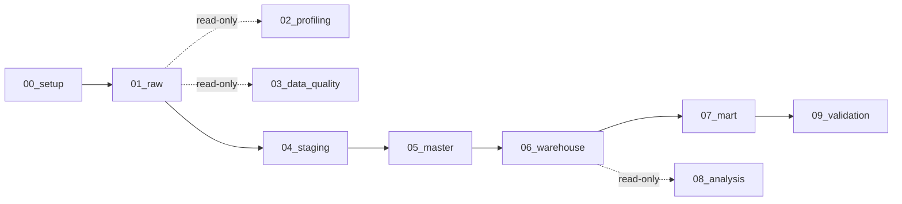

# SQL Pipeline (SQL Server / T-SQL)

> Runs on a **synthetic** dataset (not published). Comments such as *Expected: 5,200 rows* refer to that dataset.

58 scripts across 10 layers, about 9,200 lines. You do not need to read them all. Pick the path that
fits your time:

| Time | Read | You will see |
|---|---|---|
| **5 min** | [`stg_sales.sql`](04_staging/stg_sales.sql) → [`master_hcp_account_affiliations.sql`](05_master/master_hcp_account_affiliations.sql) → [`validation.sql`](09_validation/validation.sql) | cleaning ~1 M rows with quarantine and a mapping table · audited business fixes and flags · how the numbers are proven |
| **15 min** | + [`br_cross_table.sql`](03_data_quality/br_cross_table.sql) · [`fact_sales.sql`](06_warehouse/fact_sales.sql) · [`tbl_account_opportunity.sql`](07_mart/tbl_account_opportunity.sql) · [`q9_data_quality_trust.sql`](08_analysis/q9_data_quality_trust.sql) | rule → fact → mart → business answer |
| **Full** | [`run_all.sql`](run_all.sql) lists every build script in execution order | |

## How every file is organised

```sql
/* =====================================================================
   04_staging / stg_sales.sql
   Purpose / Source / Target / Grain
   1. DETECT   issues handled here (ISS-xxx) + issues deliberately NOT handled, and why
   2. RULES    column-by-column rule
   ===================================================================== */
-- 3. TRANSFORM               the query that builds the table
-- 4. TEST - case level       does each known bad value come out as intended?
-- 5. VALIDATE - table level  row counts, uniqueness, domains + "Expected:" result
```

**Reading only the header of a file gives you the reasoning.** The query below it is the
implementation. Issue ids link to the [DQ Issue Register](../docs/dq_issue_register.md).

## Map



| Folder | Files | Purpose |
|---|---|---|
| `00_setup/` | `create_database_and_schemas.sql` | Database + one schema per layer: `raw`, `stg`, `master`, `warehouse`, `mart` |
| `01_raw/` | `load_raw_tables.sql` | Load the 10 CSV files as received (all `NVARCHAR`). Raw is never modified |
| `02_profiling/` | `table_profiling.sql` | Describe the data: row counts, columns, duplicates, candidate keys |
| `03_data_quality/` | `completeness` · `uniqueness` · `validity` · `consistency` · `referential_integrity` checks · `br_single_table` · `br_cross_table` | Judge the data: every rule (DQ-xxx, RI-xxx, BR-xxx) returns violations and Pass/Fail; failures became ISS-xxx issues |
| `04_staging/` | `stg_<table>.sql` × 10 | Type, trim, sentinel → NULL, case mapping tables, exact-duplicate removal, quarantine of orphan keys |
| `05_master/` | `master_<table>.sql` × 10 | Surrogate keys, **confirmed** business fixes with audit columns, `*_flag` columns for the rest |
| `06_warehouse/` | `dim_*` × 6 · `fact_*` × 5 | Star schema, personal data removed - the Power BI source |
| `07_mart/` | `00_mart_views.sql` + `tbl_*` × 5 | One label per entity: growth tier, momentum tier, coverage tier, opportunity quadrant |
| `08_analysis/` | `q1` … `q9` | One business question per file; each header states the result |
| `09_validation/` | `validation.sql` | Lineage, model integrity, KPI reconciliation with Power BI, business sanity, performance |

## Conventions

- Names show the lineage: `raw.raw_sales` → `stg.stg_sales` → `master.master_sales` → `warehouse.fact_sales` → `mart.tbl_*`.
- `*_id` = business key from the source · `*_key` = surrogate key, created once in master and reused.
- Time logic uses the fixed as-of date `2026-06-29`, never `GETDATE()` ([D-09](../docs/decision_log.md)).
- A value changes only when its cause is confirmed; otherwise it gets a `*_flag` column ([D-03](../docs/decision_log.md)).
- Every build script is re-runnable (`DROP TABLE IF EXISTS` first).
- Column-level profiling (all 89 columns) was also run; its findings are in [docs/03](../docs/03_data_quality_approach.md) and the issue register rather than in this folder.
